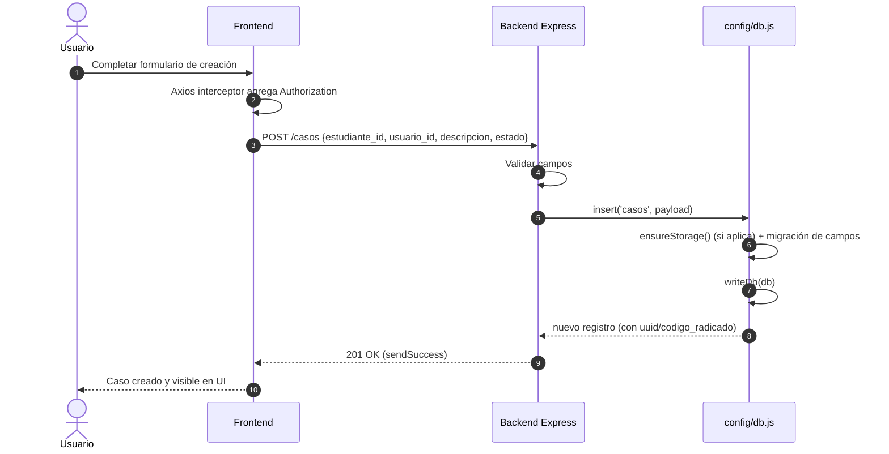
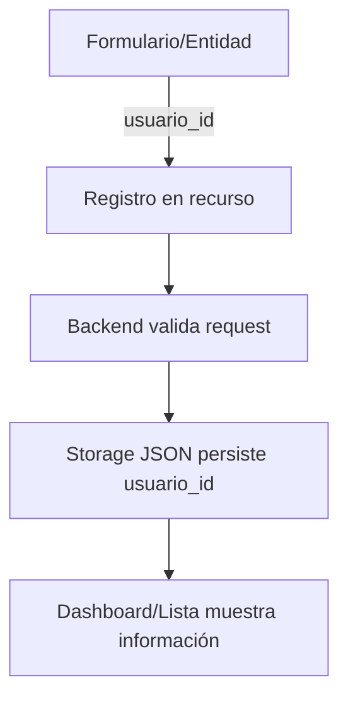
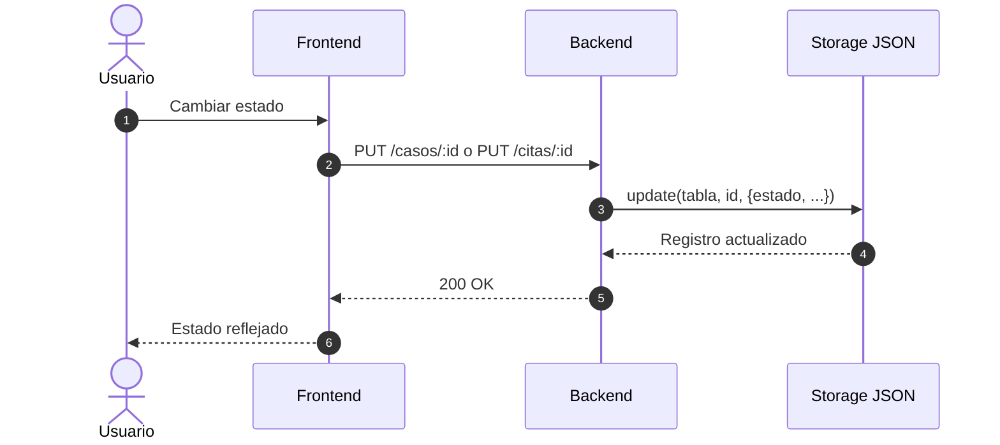
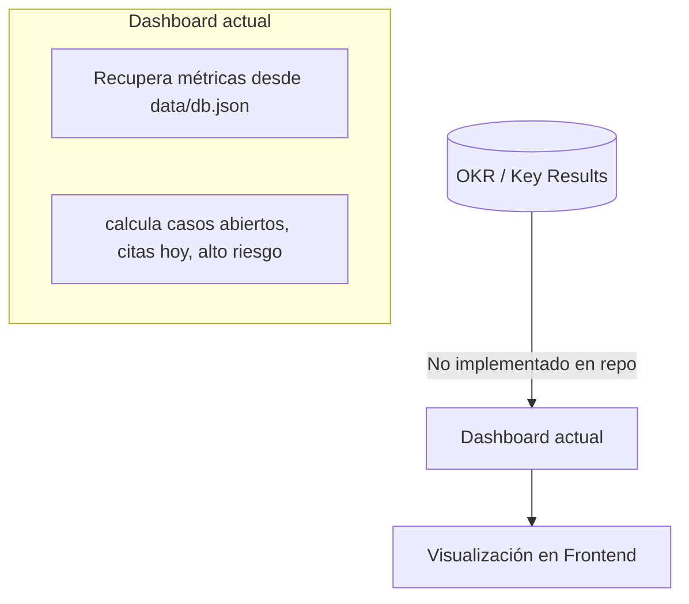

# DIAGRAMAS DEL SISTEMA — PIPE (Mermaid)

> Formatos: Mermaid.js

---

## A) Arquitectura general

```mermaid
flowchart LR
  U[Usuarios por rol] -->|Login / JWT| FE[Frontend Web (React/Vite)]
  FE -->|REST + Authorization: Bearer| BE[Backend API (Node/Express)]
  BE -->|Lectura/Escritura| DB[(Storage JSON local: data/db.json)]
  BE -->|Config (no observado en controladores)| SB[(Supabase Config)]

  FE -->|Visualiza| DASH[Dashboard: métricas]
```

---

## B) Flujo de datos

### B1) Creación de “tarea” (ejemplo: Caso)



### B2) Asignación a usuario (responsable)



### B3) Actualización de estado (ejemplo: Caso / Cita)



### B4) “Sincronización con Dashboard OKR” (pendiente)



---

## C) Diagrama de módulos

```mermaid
flowchart TB
  subgraph AUTH[Auth]
    M1[POST /auth/login]
    M2[POST /auth/register]
    MW1[authenticateToken]
    MW2[authorizeRoles]
  end

  subgraph TASKS[Tasks / Recursos]
    T1[Estudiantes]
    T2[Alertas]
    T3[Casos]
    T4[Intervenciones]
    T5[Citas]
  end

  subgraph OKR[OKR]
    O1[Pendiente / no implementado]
  end

  subgraph USERS[Users]
    U1[usuarios (tabla JSON)]
    U2[relación: usuario_id]
    U3[relación: estudiante.usuario_id]
  end

  subgraph STORAGE[Storage / DB layer]
    S1[config/db.js]
    S2[data/db.json]
    S3[migrateMissingFields(): uuid/codigo_radicado]
    S4[Prevención recursión infinita]
  end

  FE[Frontend] -->|REST| BE[Backend Express]
  BE --> MW1
  BE --> MW2
  BE --> TASKS
  BE --> USERS
  BE --> STORAGE
  BE --> OKR
```

---

**Fin — DIAGRAMAS PIPE**

